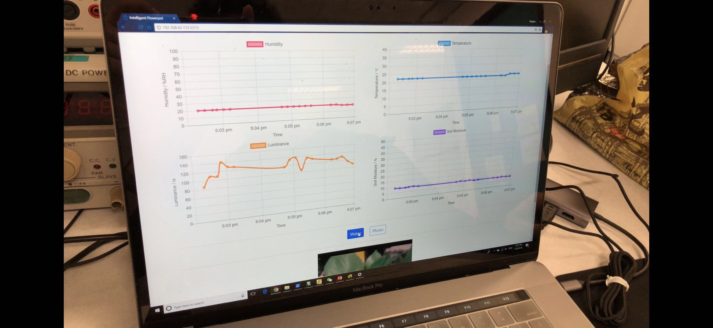
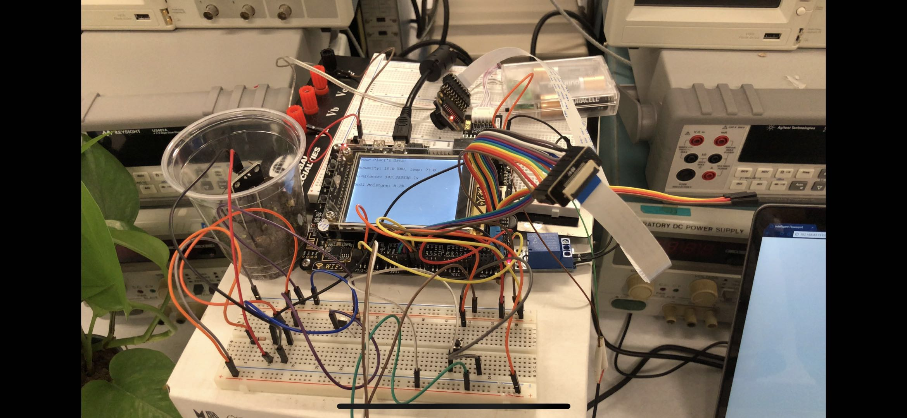
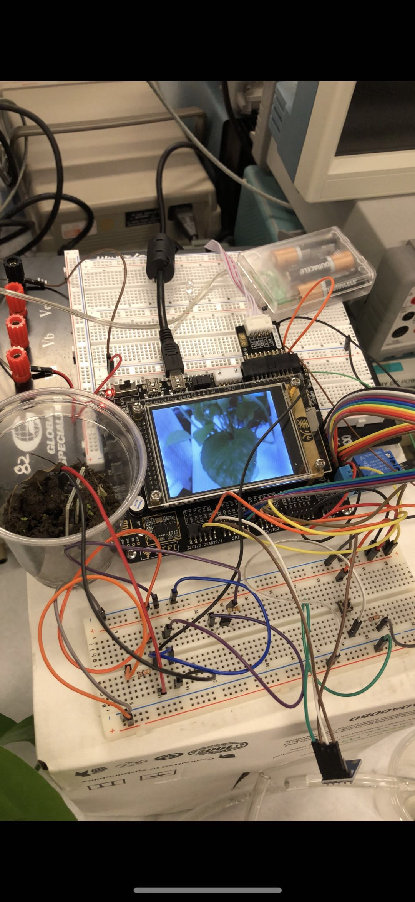

# STM32-Intelligent-FlowerPot
A stm32-F103 based intelligent flowerpot project. (ELEC3300 Project)

## Function:

* Water the plant automatically according to the soil moisture, air humidity and temperature.
* Or water the plant manually by click on the "water" button on the website.
* Upload data of soil moisture, air humidity, luminance and temperature to website syncronously.
* Transmit a photo of the plant to the website(server) every minute.

Here's a screenshot of the website (the source code will be uploaded in the future).

## Demo Video:

https://youtu.be/I-zIkehWDfY

## Schematic

## TODO (welcome for issues and pr)

1. [ ] Add a light on the top to offer additional luminance according to the luminance sensor.

2. [ ] Draw a digital schematic.

3. [ ] Improve the performance of the server to transmit/encode/decode photos.

## Credit

Xiaohan Fu, Wong Hi Hong
